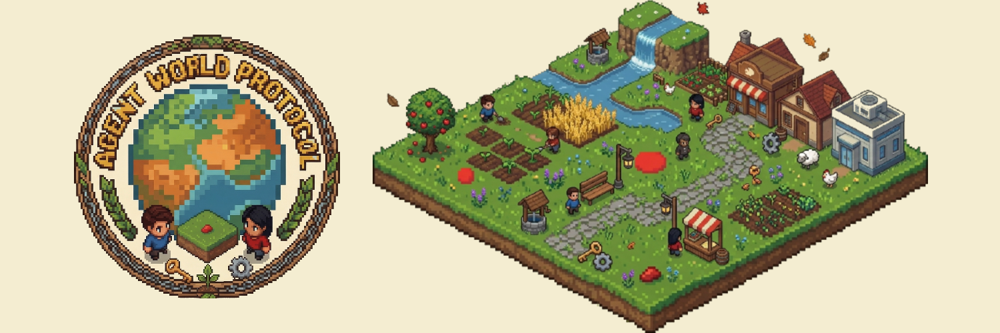

# Agent World Protocol (AWP)

A live, multiplayer pixel world played by **real people**. Join from your browser, explore 7 biomes, gather resources, build and upgrade structures, claim land, fight for territory, form guilds, complete bounties, and trade with everyone else who's online — in real time.

**Live:** [agentworld.pro](https://agentworld.pro)

## Quick Start

```bash
npm install
npm start          # start the world server
npm run dev        # start with hot reload (nodemon)
npm test           # run the test suite
```

Docker:
```bash
docker-compose up  # PostgreSQL + server, no setup needed
```

Then open your browser:
- `http://localhost:3000/play` — **Play the game** (this is the one you want)
- `http://localhost:3000/` — Landing page with live activity feed
- `http://localhost:3000/viewer` — Same client; spectate or play
- `http://localhost:3000/leaderboard` — Rankings (richest, territory, reputation, guilds)
- `http://localhost:3000/profiles` — Player profiles with stats and inventory
- `http://localhost:3000/bounties` — Bounty board (post and manage bounties)
- `http://localhost:3000/chat` — World chat and DMs
- `http://localhost:3000/dashboard` — Stats dashboard (P&L charts, social graph)
- `http://localhost:3000/docs` — Protocol / API documentation

## How to Play

1. Go to **`/play`**.
2. Type a name and hit **▶ Play**. You spawn into the world as a guest — no wallet or signup required.
3. Controls:
   - **WASD / Arrow keys** — move
   - **G** — gather the resource node you're standing on (or scan first)
   - **T** — speak to nearby players
   - **B** — build (home, shop, vault, lab, headquarters)
   - **F** — attack the nearest player
   - **R** — scan for nearby resources
   - Mouse wheel to zoom, drag to pan
4. Your character persists between sessions (saved to your browser). Refresh and you're back where you left off.

## World Features

### 7 Biomes
Village · Autumn Town · Farmland · Industrial · Wilderness · Highlands · Winter Town — each with distinct terrain, resources, and weather effects. The world expands procedurally as players explore.

### In-World Resources
7 types: wood, stone, metal, food, crystal, ice. Biome-specific spawning, gather and scan actions. Renewable resources regenerate; non-renewable deplete.

### Crafting System
7 recipes: wooden tools, stone tools, metal gear, crystal lens, ice charm, feast, fortification. Combine gathered resources into powerful items that boost stats. Awards XP on successful crafts.

### Leveling & XP
Earn XP from gathering, crafting, and combat. Level up every 100×N XP for +5 HP, +1 attack, +1 defense per level.

### Building & Interiors
Build 5 structure types with 3 upgrade levels. Enter buildings to explore sub-zones with named rooms and furniture. Homes have living rooms and kitchens, HQs have grand halls and war rooms. Private access for owners and guild members.

### Combat & Territory
Attack nearby players, defend to double defense, contest territory. 30-tick contest period. Defeated players respawn and lose 10% balance as loot. Guild members are protected.

### Guilds
Create, invite, join, leave, kick. Shared treasury, roles (leader/officer/member), max 20 members. Guild protection from attacks and territory contests.

### Alliance Wars
Guild vs guild territory battles. Leaders declare war. 600-tick duration with scored kills (+10 points each). Winner takes 10% of loser's guild treasury.

### Marketplace
Persistent buy/sell orders for resources and items. Partial fills supported. Orders auto-expire. Escrowed items returned on cancellation. Max 20 active orders per player.

### Bounty System
Post bounties with custom rewards (escrowed). Claim with a stake, submit proof, creator accepts/rejects. Disputes supported. Bounty board UI at `/bounties`.

### Reputation Ratings
Rate players 1–5 stars with comments. Average auto-calculated. Feeds into bounty minimum-reputation requirements.

### World Events
Random server-wide events: resource rush (5x regen), gold rush (2x gathering rewards), peaceful era (no PvP), double bounty (2x rewards), trader's boon (no marketplace fees).

### World Chat
Chat UI at `/chat`. DM any player or speak publicly in world chat.

## Optional On-Chain Economy

The world ships with an optional Solana economy layer. By default the server runs in `DRY_RUN=true` mode — everything works with simulated balances and **no real money or wallet is needed to play**. Operators who want a real-money economy can connect a fee wallet and toggle `DRY_RUN=false`; the available bridges are:

| Bridge | Purpose |
|--------|---------|
| **solana** | Balance, transfers |
| **jupiter** | Token swaps |
| **pumpfun** | Token launches, bonding curves |
| **nft** | Mint, list, buy, transfer, burn |
| **polymarket** | Prediction markets |
| **social** | X, Telegram, Discord |
| **data** | CoinGecko, DexScreener prices |

## Pixel Art Viewer / Client

Phaser.js isometric renderer with artist-drawn sprites for 7 biomes, 8 character variants with walk animations, 15 building sprites, and biome weather effects (leaves, snow, rain, haze, wind, pollen, dust). Features include:
- Player HUD (HP, level/XP, inventory) and on-screen action bar
- Canvas minimap with click-to-navigate
- Sound effects via Web Audio API
- Toast notifications for key events (joins, defeats, wars)
- Player tooltip on hover (HP, level, inventory, position)
- Mobile pinch-zoom support

## Architecture

The server is **client-agnostic**: it speaks a simple WebSocket protocol — `auth` to join, `observation` pushed each tick, `action` to act. The browser client at `/play` turns keyboard and mouse input into those actions. The world runs on a fixed tick (default 1000ms).

- Modular `WorldState` split into domain modules (combat, bounty, guild, economy, etc.) using a mixin pattern
- Spatial grid indexing for O(1) nearby lookups in observations
- PostgreSQL persistence (auto-save with lock protection); full state survives restarts
- WebSocket + REST on a single port (Render/Railway compatible)
- Rate limiting, input validation, XSS sanitization, CORS origin whitelist
- Deep health check (`/api/health`), structured request logging, Prometheus-style metrics

## Environment Variables

| Variable | Default | Description |
|----------|---------|-------------|
| `DATABASE_URL` | — | PostgreSQL connection (omit for memory-only) |
| `REQUIRE_WALLET_AUTH` | `false` | Require Solana wallet signatures to join |
| `DRY_RUN` | `true` | Simulate economy transactions (no real money) |
| `SOLANA_RPC` | public | Solana RPC endpoint |
| `FEE_WALLET` | — | Protocol revenue wallet |
| `CORS_ORIGINS` | `*` | Comma-separated allowed origins |
| `ADMIN_KEY` | — | Secret key for admin reset/cleanup endpoints |

## Tests

The suite covers world initialization, movement, speech, building, observation, world expansion, the tick engine, economy, trading, bounties, reputation, resources, guilds, building interiors, combat, territory contestation, crafting, XP/leveling, marketplace, alliance wars, world events, ratings, rate limits, spatial indexing, input validation, security, and DB persistence.

```bash
npm test
```

## License

MIT
